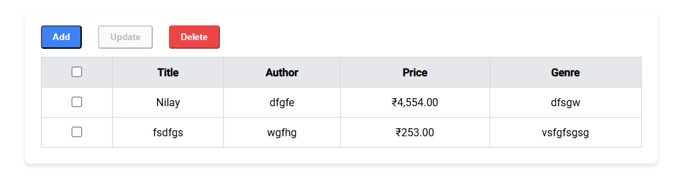

# 📚 Bookstore Management System

A full-stack application for managing books, powered by a Spring Boot backend and an Angular frontend.

## ✨ Features

### 🚀 Backend (Spring Boot)

* RESTful API with full CRUD functionality
* MySQL database integration
* Spring Data JPA for seamless ORM
* Hibernate Validator for input validation
* CORS configuration for frontend-backend communication

### 🎨 Frontend (Angular)

* Dynamic book listing with pagination
* Add, Edit, Delete book records
* Bulk operations for efficiency
* Reactive forms with validation
* Responsive UI with Angular Material

## 🛠️ Tech Stack

### Backend 🖥️

* Java 20
* Spring Boot 3.4.4
* Spring Data JPA
* Hibernate Validator
* MySQL 8.0+

### Frontend 🌐

* Angular 16+
* Angular Material
* RxJS for reactive programming
* TypeScript

## 📋 Prerequisites

Ensure you have the following installed:

* JDK 20
* Node.js 18+ & NPM
* Angular CLI
* MySQL 8.0+
* Maven

## 🚀 Installation Guide

### 🔧 Backend Setup

1.  Clone the repository:

    ```bash
    git clone https://github.com/logicalNil/BookManagementSQL
    ```

2.  Configure the database:

    * Update `application.properties` with your MySQL credentials.

3.  Build & run the backend:

    ```bash
    mvn clean install
    mvn spring-boot:run
    ```

### 🎨 Frontend Setup

1.  Navigate to the frontend directory:

    ```bash
    cd ../frontend
    ```

2.  Install dependencies:

    ```bash
    npm install
    ```

3.  Start the Angular development server:

    ```bash
    ng serve
    ```

4.  The application will be available at: `http://localhost:4200/`


